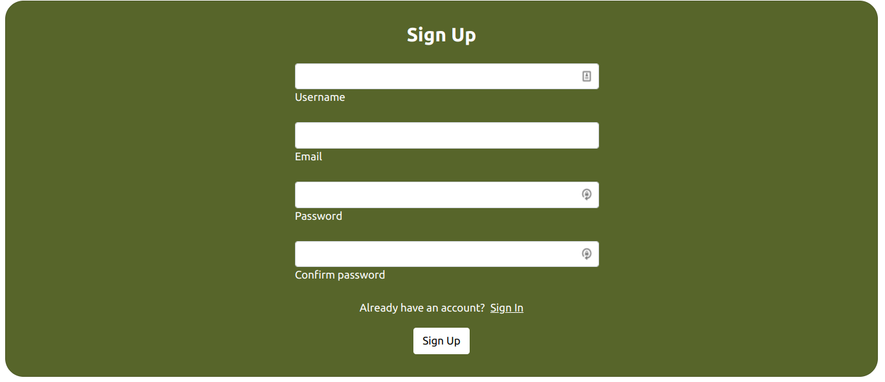
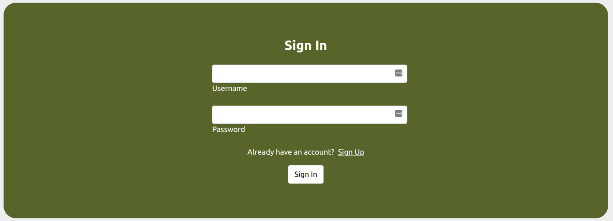
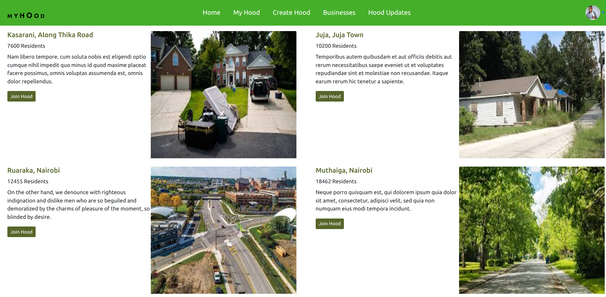
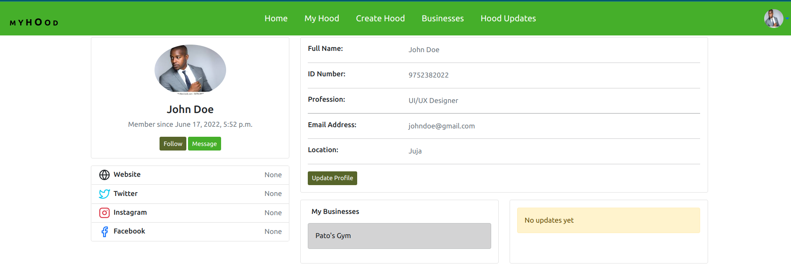
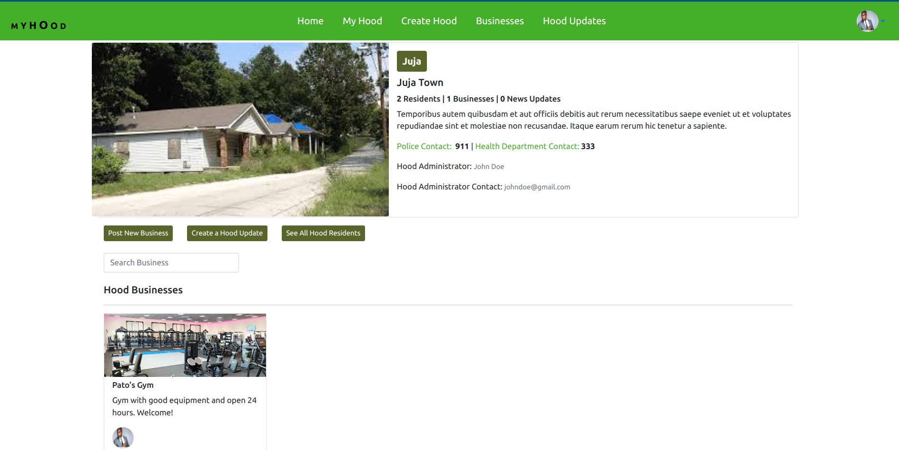
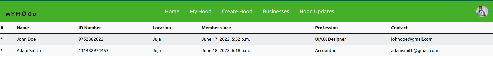
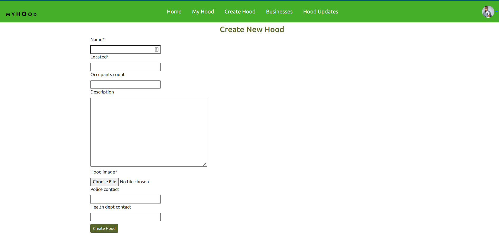

# Myhood

Myhood is a simple web application for people to stay on the loop with what is happening in their neigborhoods. Once registered and logged in, a user can join one of the many neighborhoods created by other users, or create a new neighborhood. As a member of a neihborhood, a user can see updates posted by other members of the same neighborhood. These could include new businesses in the neighborhood and othe general information that might be important. A user can also create a new updates for other members to see, and can post new businesses as well. A user can leave one neighborhood and join a different neighborhood, but cannot be a member of two neighborhoods at the same time.

# By **Robert Kirui**

June 19, 2022.

# Description

Most people would like to receive important updates on whatever is happening in their neighborhoods. Also, contact information of important departments in the neighborhood such as the police and health departments can be vital moreso during emergency cases. For this reason, it is important to have a platform where such information can be accessed more easily. Myhood is a web application that offers exactly this. Users can register on the application, login, see different neighborhoods posted by other users of the app, create a new neighborhood, join a neighborhood, access important information of the specific neighborhood in which he/she belongs, post new businesses for members of that neighborhoods to see, post important updates, and leave the neighborhood when necesary. This ensures that as a member of a given neighborhood, a user can access information and updates regarding that neighborhood with ease.

# User Stories

    - As a user, I would like to sign in with the application to start using.
    - As a user, I would like to set up a profile about me and a general location and my neighborhood name.
    - As a user, I would like to find a list of different businesses in my neighborhood.
    - As a user, I would like to find Contact Information for the health department and Police authorities near my neighborhood.
    - As a user, I would like to create Posts that will be visible to everyone in my neighborhood.
    - As a user, I would like to change My neighborhood when I decide to move out.
    - As a user, I would like to, I would lile to only view details of a single neighborhood.

# Screenshots

### Sign up and Sign in pages

 

### home page

### User profile page

### Neigborhood details page

### Neigborhood residents list page

### Create new neigborhood page

# Behaviour Driven Development (BDD)

# Setup/Installation

- Fork the project from this repo
- Run git clone https://github.com/Kirugik/myhood.git to have the project files in your preferred directory on the local machine.
- Change directory into the specific folder containing the project files.
- Run 'pip install -r requirements.txt' to install the project dependencies.
- Run the project in the terminal using: 'python3.8 manage.py runserver'

# Technologies Used

Python, Django, HTML, CSS, heroku

# License

- Licensed under the [MIT License] (LICENSE).

Copyright (c) 2022. **Robert Kirui**
